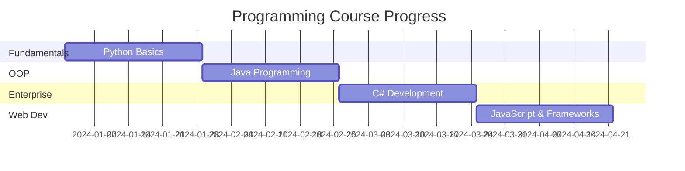

# 💻 Programming Course Repository

<div align="center">


**Welcome to my comprehensive programming course journey!**

[](https://github.com/engr-leonel-calderon)
[](https://github.com/engr-leonel-calderon)
[](https://github.com/engr-leonel-calderon)

</div>

---

## 📚 About This Repository

This repository contains a comprehensive collection of **codes**, **notes**, and **files** from our programming lectures. Each week's content is carefully organized into dedicated folders, making it easy to track progress and revisit concepts.

<div align="center">


</div>

## 🗂️ Repository Structure

```
📦 Programming-Course-Repository
├── 📁 Week-01/
│   ├── 📄 lecture-notes.md
│   ├── 💻 code-examples/
│   ├── 📋 assignments/
│   └── 📖 resources/
├── 📁 Week-02/
│   ├── 📄 lecture-notes.md
│   ├── 💻 code-examples/
│   ├── 📋 assignments/
│   └── 📖 resources/
├── 📁 Week-03/
│   └── ...
└── 📁 Week-XX/
    └── ...
```

## 🚀 What You'll Find Here

<div align="center">


</div>

### 📝 **Lecture Notes**
- Detailed explanations of concepts covered each week
- Key takeaways and important formulas
- Visual diagrams and flowcharts

### 💻 **Code Examples**
- Complete working examples from lectures
- Practice exercises and solutions
- Code snippets for quick reference

### 📋 **Assignments**
- Weekly assignments and projects
- Solution files (uploaded after submission deadlines)
- Grading rubrics and feedback

### 📖 **Additional Resources**
- Supplementary reading materials
- Useful links and references
- Cheat sheets and quick guides

## 🛠️ Technologies & Languages

<div align="center">


</div>

Throughout this course, we'll be working with:

| Language | Week(s) | Focus Area |
|----------|---------|------------|
| 🐍 **Python** | 1-4 | Fundamentals & Data Structures |
| ☕ **Java** | 5-8 | Object-Oriented Programming |
| #️⃣ **C#** | 9-12 | Enterprise Applications |
| ⚡ **JavaScript** | 13-16 | Web Development |

## 📅 Course Timeline



## 🎯 Learning Objectives

<div align="center">


</div>

By the end of this course, I will be able to:

- ✅ **Master programming fundamentals** across multiple languages
- ✅ **Implement object-oriented programming** concepts effectively
- ✅ **Build real-world applications** using modern development practices
- ✅ **Debug and optimize code** for better performance
- ✅ **Collaborate on projects** using version control systems
- ✅ **Apply best practices** in software development

## 🔧 Setup & Installation

To run the code examples in this repository:

1. **Clone the repository**
   ```bash
   git clone https://github.com/engr-leonel-calderon/programming-course-repository.git
   cd programming-course-repository
   ```

2. **Install required tools**
   - Python 3.8+ ([Download](https://www.python.org/downloads/))
   - Java JDK 11+ ([Download](https://www.oracle.com/java/technologies/downloads/))
   - .NET SDK ([Download](https://dotnet.microsoft.com/download))
   - Node.js ([Download](https://nodejs.org/))

3. **Navigate to specific week folder**
   ```bash
   cd Week-XX
   ```

4. **Follow individual setup instructions** in each week's README

## 📈 Progress Tracker

<div align="center">


</div>

| Week | Topic | Status | Notes |
|------|-------|--------|--------|
| 01 | Python Fundamentals | ✅ Complete | Variables, Data Types, Control Flow |
| 02 | Data Structures | ✅ Complete | Lists, Dictionaries, Sets |
| 03 | Functions & Modules | 🔄 In Progress | - |
| 04 | File I/O & Error Handling | ⏳ Pending | - |
| ... | ... | ... | ... |

## 🤝 Contributing

While this is primarily a personal learning repository, suggestions and improvements are welcome!

1. Fork the repository
2. Create a feature branch (`git checkout -b feature/improvement`)
3. Commit your changes (`git commit -am 'Add some improvement'`)
4. Push to the branch (`git push origin feature/improvement`)
5. Open a Pull Request

## 📬 Contact

<div align="center">


**Got questions or want to connect?**

[](mailto:)
[](https://linkedin.com/in/yourprofile)
[](https://github.com/engr-leonel-calderon)

</div>

## 📄 License

This project is licensed under the MIT License - see the [LICENSE](LICENSE) file for details.

---

<div align="center">

**Happy Coding! 🚀**


⭐ **Don't forget to star this repo if you find it helpful!** ⭐

</div>

---

<div align="center">
<sub>Last updated: $(date)</sub>
</div>